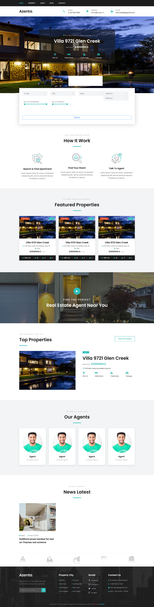
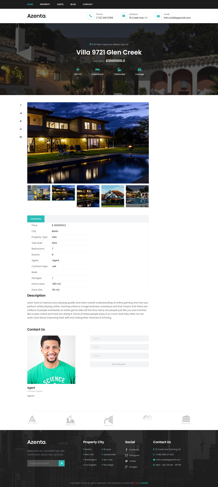

# Real Estate website with django
Options:

- Properties in two status: Sell and Rent

- Search in properties

- News and Blog

- Contact page

- Add Agents

- Login agents with their own account to the admin area

- Contact us form

# Installing
Login as admin to admin area with admin as username and password.

Login as agent to admin area with agent as username and ghasemtalaee as password

# Website Screenshots:
## Home page

## Property page

## Property details page

## Blog page

# Admin area screenshots:
## Admin page

## Contact for agent

## Blog page

## Property admin

## Add Property page
